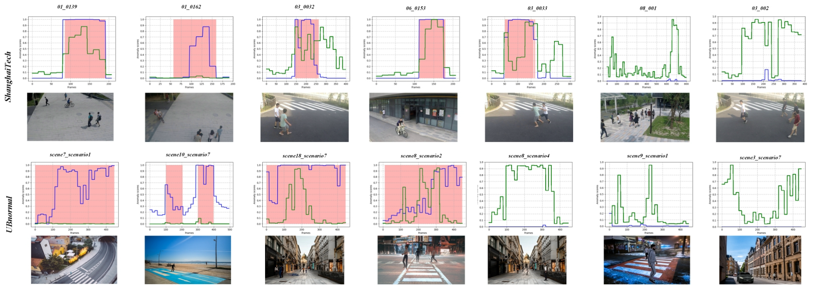

<!-- Title & Author Block – Clean inline layout (no ORCID icons) -->
<h1 align="center">📹 Dual-Detector Reoptimization for Federated Weakly Supervised Video Anomaly Detection via Adaptive Dynamic Recursive Mapping</h1>

<div align="center" style="font-size:1.05em; line-height:1.4;">
  <span style="display:inline-block; margin:0 1rem; white-space:nowrap;">
    <a href="https://orcid.org/0000-0002-6851-4142" target="_blank"><strong>Yong&nbsp;Su</strong></a><sup>1,*,†</sup>
  </span>
  
  <span style="display:inline-block; margin:0 1rem; white-space:nowrap;">
    <a href="https://github.com/rekkles2" target="_blank"><strong>Jiahang&nbsp;Li</strong></a><sup>1,*</sup>
  </span>

  <span style="display:inline-block; margin:0 1rem; white-space:nowrap;">
    <strong>Simin&nbsp;An</strong><sup>1</sup>
  </span>

  <span style="display:inline-block; margin:0 1rem; white-space:nowrap;">
    <strong>Hengpeng&nbsp;Xu</strong><sup>1</sup>
  </span>

  <span style="display:inline-block; margin:0 1rem; white-space:nowrap;">
    <a href="https://terrypangooo.github.io/" target="_blank"><strong>Weilong&nbsp;Peng</strong></a><sup>2</sup>
  </span>
</div>

<p align="center" style="margin-top:0.4em;">
  <sup>1</sup> Tianjin Normal University &nbsp;&nbsp;
  <sup>2</sup> School of Computer Science and Cyber Engineering, Guangzhou University
</p>

<p align="center" style="font-size:0.95em; color:#555;">
  <sup>*</sup> Equal contribution &nbsp;&nbsp;
  <sup>†</sup> Corresponding author
</p>

[](https://paperswithcode.com/sota/weakly-supervised-video-anomaly-detection-on?p=dual-detector-re-optimization-for-federated)
[](https://paperswithcode.com/sota/weakly-supervised-video-anomaly-detection-on-1?p=dual-detector-re-optimization-for-federated)

---


## 📄 Abstract

> Federated weakly supervised video anomaly
> detection represents a significant advancement in privacy-preserving collaborative learning,
> enabling distributed clients to train anomaly detectors using only video-level annotations.
> However, the inherent challenges of optimizing noisy representation with coarse-grained labels
> often result in substantial local model errors, which are exacerbated during federated aggregation,
> particularly in heterogeneous scenarios. To address these limitations, we propose a novel
> dual-detector framework incorporating adaptive dynamic recursive mapping, which significantly
> enhances local model accuracy and robustness against representation noise. Our framework
> integrates two complementary components: a channel-averaged anomaly detector and a
> channel-statistical anomaly detector, which interact through cross-detector adaptive decision
> parameters to enable iterative optimization and stable anomaly scoring across all instances.
> Furthermore, we introduce the scene similarity adaptive local aggregation algorithm, which
> dynamically aggregates and learns private models based on scene similarity, thereby enhancing
> generalization capabilities across diverse scenarios. Extensive experiments conducted on the
> NVIDIA Jetson AGX Xavier platform using the ShanghaiTech and UBnormal datasets demonstrate
> the superior performance of our approach in both centralized and federated settings. Notably,
> in federated environments, our method achieves remarkable improvements of 6.2% and 12.3% in AUC
> compared to state-of-the-art methods, underscoring its effectiveness in resource-constrained
> scenarios and its potential for real-world applications in distributed video surveillance systems.

<p align="center">
  
  <br>
  <em>Figure 1: Overview of the proposed dual-detector re-optimization framework featuring adaptive dynamic recursive mapping for federated weakly supervised video anomaly detection (Fed-WSVAD).</em>
</p>

## 📌 Key Contributions

- We introduce a dual-detector framework that leverages adaptive dynamic recursive mapping and decision parameter interaction to generate more stable anomaly scores, thereby enhancing detection accuracy.
- We introduce the SSALA algorithm to learn private local models, enabling effective parameter aggregation across clients and mitigating the effects of scene heterogeneity.
- We demonstrated superior detection performance and robustness through experiments on two benchmark datasets, validating the effectiveness of the proposed framework in both federated and centralized settings.

---


### 📊 Model Performance Summary

Performance comparison (AUC / FAR) on standard benchmarks.

| Dataset                                                                                                    | Centralized (AUC / FAR) | FedSSALA (AUC / FAR) | Pretrained Models                                                                                      |
| :--------------------------------------------------------------------------------------------------------- | :---------------------- | :------------------- | :----------------------------------------------------------------------------------------------------- |
| [🔗 ShanghaiTech](https://drive.google.com/drive/folders/1gArYo-e11ddrWj0lj3w055jPmGPywMqF?usp=drive_link) | **97.91% / 0.04%**      | **97.86% / 0.03%**   | [📥 Download](https://drive.google.com/drive/folders/1s7QWEfbHbb5LfaaHqBFw9pKSXDJtocAK?usp=drive_link) |
| [🔗 UBnormal](https://drive.google.com/drive/folders/1J_6UTtcjibtJ7qiOFeHeLMiJ6xAciWK3?usp=drive_link)     | **70.91% / 0.00%**      | **76.51% / 0.00%**   | [📥 Download](https://drive.google.com/drive/folders/1s7QWEfbHbb5LfaaHqBFw9pKSXDJtocAK?usp=drive_link) |


---

## 📑 Table of Contents

-   [WSVAD](#wsvad)
-   [Feature Extraction Guide (VideoMAE V2 Backbone)](https://github.com/rekkles2/Fed_WSVAD/blob/main/Backbone/README.md)
-   [Jetson AGX Xavier Deployment Guide](https://github.com/rekkles2/Fed_WSVAD/blob/main/Fed_VAD/Jetson%20AGX%20Xavier%20Deployment%20Guide.md)
-   [Federated Setup (Fed-WSVAD)](https://github.com/rekkles2/Fed_WSVAD/blob/main/Fed_VAD/README.md)

---

# WSVAD

## 🔧 Setup Instructions

1.  **Clone the repository:**
    ```bash
    git clone https://github.com/rekkles2/Fed_WSVAD.git
    cd Fed_WSVAD
    ```

2.  **Create and activate the Conda environment:**
    *(Check the `VAD/environment.yml` file for the specific environment name if it's defined there, e.g., `vad_env`)*
    ```bash
    conda env create -f VAD/environment.yml
    conda activate <your_environment_name> # e.g., conda activate vad_env
    ```

---

## ▶️ Running

```bash
python main.py
````

---

## 🏆 Evaluation

To evaluate the pretrained model (e.g., on ShanghaiTech), run the following command:

```bash
# Ensure the path to the .pkl model file is correct.
python VAD/inference.py --inference_model='shanghaitech.pkl'
```

---


## 📈 Experimental Results

### 📄 Table I: Results on ShanghaiTech Dataset

Comparison with state-of-the-art methods on the ShanghaiTech dataset.
(*\* = utilizes ten-crop augmentation during testing, ★ = centralized training baseline. **Bold** = best result, *italic* = second best result.*)

| Method              | Year      | Feature   | AUC (%)       | FAR (%)       |
| :------------------ | :-------- | :-------- | :------------ | :------------ |
| MIL-Rank            | 2018 CVPR | C3D       | 85.33         | 0.15          |
| AR-Net              | 2020 ICME | I3D\*/MAE | 91.24 / 96.87 | 0.10 / 0.12   |
| RTFM                | 2021 ICCV | I3D\*/MAE | 97.21 / 96.89 | 1.06 / *0.05* |
| MIST                | 2021 CVPR | I3D       | 94.83         | *0.05*        |
| MSL                 | 2022 AAAI | I3D\*     | 96.08         | -             |
| UML                 | 2023 CVPR | I3D       | 96.78         | -             |
| CLAV-CoMo           | 2023 CVPR | I3D\*     | *97.59*       | -             |
| RTFM-BERT           | 2024 WACV | I3D\*     | 97.54         | -             |
| **Ours ★**          | -         | MAE       | **97.91**     | **0.04**      |
| Fed-AR-Net (Fedavg) | -         | I3D       | 85.63         | -             |
| Fed-RTFM (Fedavg)   | -         | I3D       | 92.17         | -             |
| CAAD (Fedavg)       | -         | I3D       | 95.78         | -             |
| CAAD (SSALA)        | -         | I3D       | 96.13         | -             |
| **Ours (SSALA)**    | -         | MAE       | **97.86**     | **0.03**      |

---

### 📄 Table II: Results on UBnormal Dataset

Comparison with state-of-the-art methods on the UBnormal dataset.
(*★ = centralized training baseline. **Bold** = best result, *italic* = second best result.*)

| Method              | Year       | Feature | AUC (%)   | FAR (%)   |
| :------------------ | :--------- | :------ | :-------- | :-------- |
| MIL-Rank            | 2018 CVPR  | C3D     | 54.12     | -         |
| AR-Net              | 2020 ICME  | I3D\*   | 62.30     | -         |
| RTFM                | 2021 ICCV  | I3D\*   | 66.83     | -         |
| MIST                | 2021 CVPR  | I3D\*   | 65.32     | -         |
| OPVAD               | 2024 CVPR  | CLIP    | 62.94     | -         |
| VadCLIP             | 2024 AAAI  | CLIP    | 62.32     | -         |
| STPrompt            | 2024 ArXiv | CLIP    | 63.98     | -         |
| *OCC-WS*            | 2024 ECCV  | I3D     | *67.42*   | -         |
| **Ours ★**          | -          | MAE     | **70.91** | **0.00%** |
| Fed-AR-Net (Fedavg) | -          | I3D     | 65.74     | -         |
| Fed-RTFM (Fedavg)   | -          | I3D     | 68.12     | -         |
| CAAD (Fedavg)       | -          | I3D     | 67.18     | -         |
| CAAD (SSALA)        | -          | I3D     | 71.33     | -         |
| **Ours (SSALA)**    | -          | MAE     | **76.51** | **0.00%** |

---

### 🧪 Table III: Ablation Study on ShanghaiTech

Ablation analysis of key components in our proposed federated framework.
*(\[Define CAAD, CSAD, TA, EN components here or refer to paper section]. W/O SSALA shows performance using standard FedAvg instead of our SSALA. Size indicates model parameters.)*

| CAAD | CSAD | TA | EN | AUC (%)   | AUC (%) W/O SSALA | Size (Millions) |
| :--- | :--- | :- | :- | :-------- | :---------------- | :-------------- |
| ✔    | ✘    | ✘  | ✘  | 95.08     | 88.29             | 1.9M            |
| ✘    | ✔    | ✘  | ✘  | 96.37     | 94.39             | 1.9M            |
| ✔    | ✘    | ✔  | ✘  | 95.68     | 93.28             | 1.9M            |
| ✘    | ✔    | ✔  | ✘  | 96.59     | 91.67             | 1.9M            |
| ✔    | ✔    | ✔  | ✔  | **97.86** | 95.90             | 9.9M            |

---

### 🧭 Table IV: Scene-Specific AUC (%) on ShanghaiTech

Scene-specific performance comparison on the ShanghaiTech dataset. This analysis evaluates robustness when the definition of 'normal' changes for certain scenes.
*(★ = scene where 'normal' activity definition was redefined (e.g., including bicycles as normal), △ = scene with unchanged anomaly definition. 'Baseline' refers to centralized baseline; 'Revised' refers to redefined label scenario. 'Δ Change' shows difference.)*

| Scene    | 1△    | 2△    | 3     | 4★    | 5     | 6★    | 7     | 8     | 9      | 10★   | 11★    | 12★    | 13     | Avg   |
| :------- | :---- | :---- | :---- | :---- | :---- | :---- | :---- | :---- | :----- | :---- | :----- | :----- | :----- | :---- |
| Baseline | 89.77 | 87.35 | 78.00 | 92.28 | 98.31 | 98.08 | 93.58 | 92.02 | 100.00 | 86.58 | 100.00 | 97.84  | 100.00 | 93.31 |
| Revised  | 87.16 | 81.91 | 77.12 | 94.65 | 98.47 | 96.59 | 92.03 | 91.13 | 100.00 | 86.09 | 100.00 | 89.13  | 100.00 | 91.39 |
| Δ Change | -2.61 | -5.44 | -0.88 | +2.37 | +0.16 | -1.49 | -1.55 | -0.89 | 0.00   | -0.49 | 0.00   | -8.71  | 0.00   | -1.92 |
|          |       |       |       |       |       |       |       |       |        |       |        |        |        |       |
| **Ours** | 97.63 | 99.22 | 88.52 | 96.28 | 98.51 | 99.55 | 97.54 | 97.31 | 100.00 | 99.69 | 100.00 | 98.94  | 100.00 | 97.86 |
| Revised  | 97.75 | 98.29 | 88.43 | 90.82 | 98.81 | 99.97 | 98.86 | 96.89 | 100.00 | 99.41 | 100.00 | 100.00 | 100.00 | 97.62 |
| Δ Change | +0.12 | -0.93 | -0.09 | -5.46 | +0.30 | +0.42 | +1.32 | -0.42 | 0.00   | -0.28 | 0.00   | +1.06  | 0.00   | -0.24 |
---

###  📊 Anomaly Scores and Corresponding Video Frames

<p align="center">
  
<br>
<em>Figure 2: Anomaly scores and corresponding video frames from ShanghaiTech and UBnormal Datasets. The top row displays anomaly scores with corresponding video frames from the ShanghaiTech dataset, while the bottom row presents similar results for the UBnormal dataset. Green lines indicate baseline model predictions, and blue lines correspond to our results. Highlighted red areas denote frames containing anomalies.</em>
</p>

---


## 📚 Citation

<p align="center">
  <strong>⭐ If you find this project helpful, please star the repository and cite our paper.</strong>
</p>

<details open>
  <summary><strong>📋 BibTeX (click to expand)</strong></summary>

```bibtex
@ARTICLE{11036561,
  author  = {Su, Yong and Li, Jiahang and An, Simin and Xu, Hengpeng and Peng, Weilong},
  journal = {IEEE Transactions on Industrial Informatics},
  title   = {Dual-Detector Reoptimization for Federated Weakly Supervised Video Anomaly Detection via Adaptive Dynamic Recursive Mapping},
  year    = {2025},
  volume  = {},
  number  = {},
  pages   = {1–11},
  keywords = {Adaptation models;Training;Anomaly detection;Feature extraction;Surveillance;Optimization;Accuracy;Privacy;Detectors;Semantics;Adaptive dynamic recursive mapping;adaptive local aggregation;federated;scene-similarity;video anomaly detection (VAD);weakly supervised},
  doi     = {10.1109/TII.2025.3574406}
}
````

</details>

---

## 🙏 Acknowledgements

We gratefully acknowledge the authors of the following open-source repositories for their invaluable contributions:

* 🌸 **Flower Framework**: [https://github.com/adap/flower](https://github.com/adap/flower)
* 🕵️ **AR-Net**: [https://github.com/wanboyang/Anomaly\_AR\_Net\_ICME\_2020](https://github.com/wanboyang/Anomaly_AR_Net_ICME_2020)
* 🤝 **FedALA**: [https://github.com/TsingZ0/FedALA](https://github.com/TsingZ0/FedALA)

<div align="center">
  <a href="https://clustrmaps.com/site/1c67u" title="ClustrMaps">
    
  </a>
</div>


